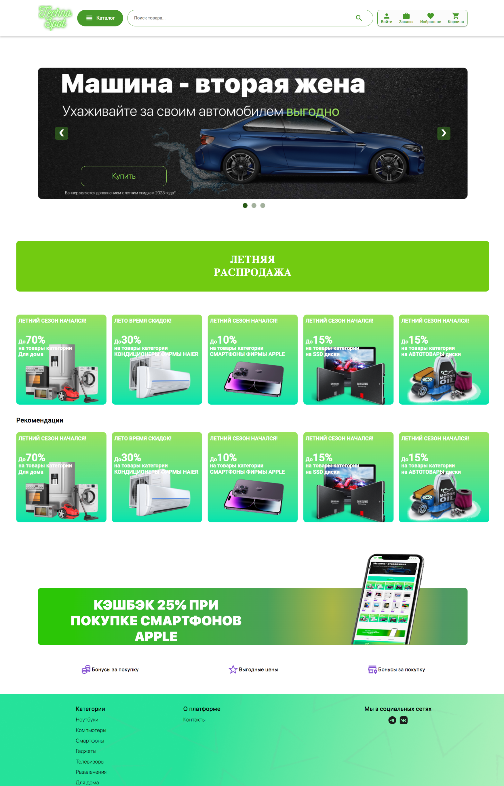
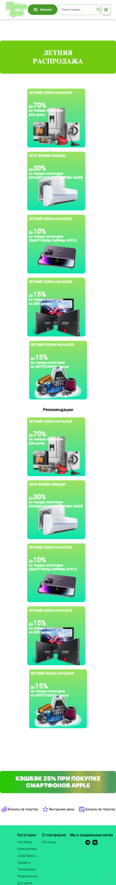

# diplom
## О проекте

Этот дипломный проект представляет собой электронный магазин, полностью смоделированный в Figma и реализованный с использованием Angular. В проекте реализована функциональность для отображения товаров, а также возможность регистрации и авторизации пользователей через личный кабинет.

## Технологии

- **Frontend**: Angular
- **Backend**: Node.js
- **Хранение данных**: Google Firebase
- **Дизайн**: Figma

## Функционал

- Просмотр товаров с возможностью фильтрации и сортировки.
- Регистрация и авторизация пользователей для доступа к личному кабинету.
- Интеграция с Google Firebase для хранения информации о товарах.
- Адаптивный дизайн, обеспечивающий удобное использование на мобильных и десктопных устройствах.

## Screenshots

### PC WIDTH

### Mobile WIDTH

